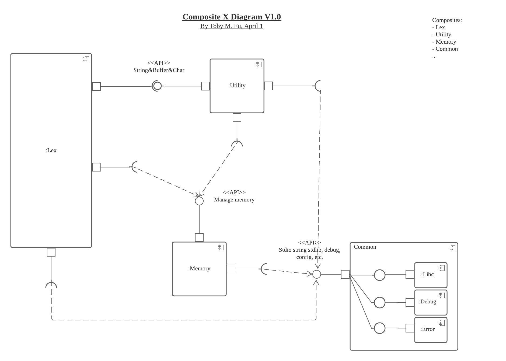
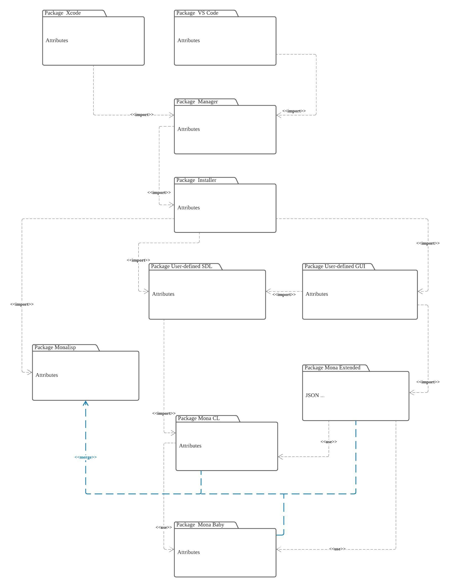
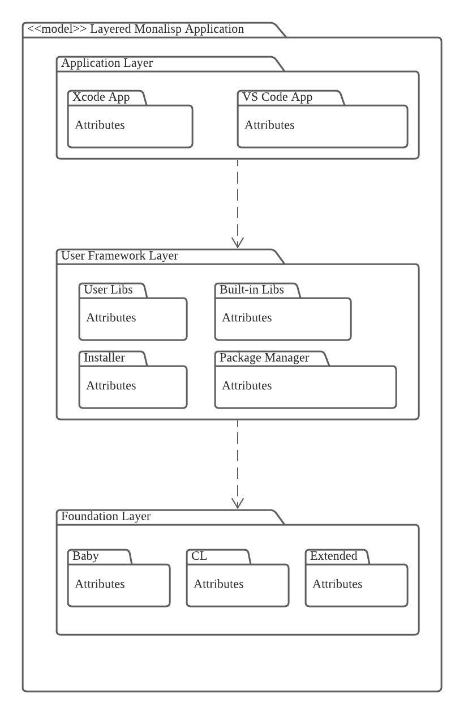
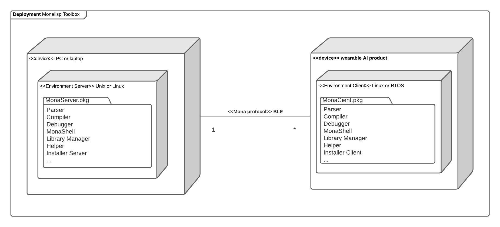
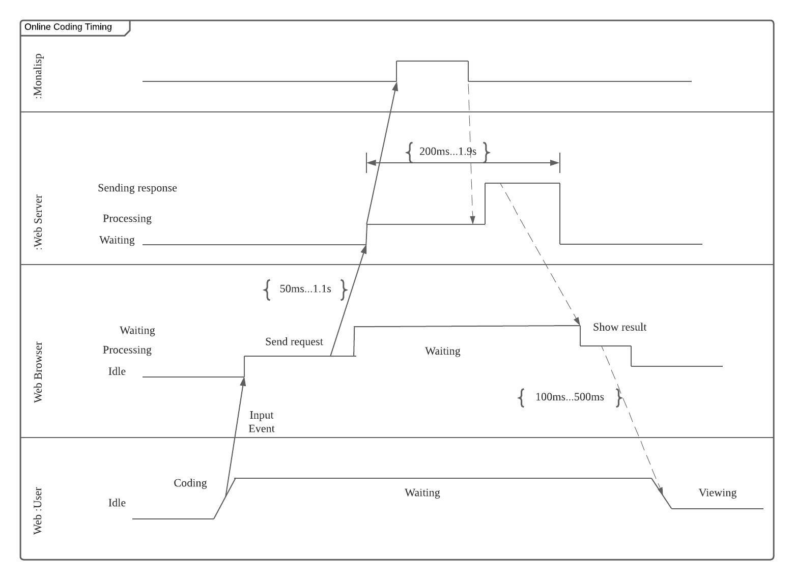
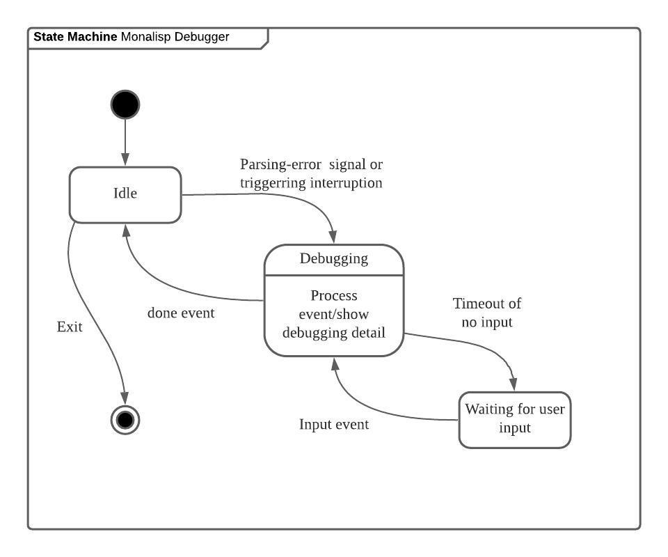
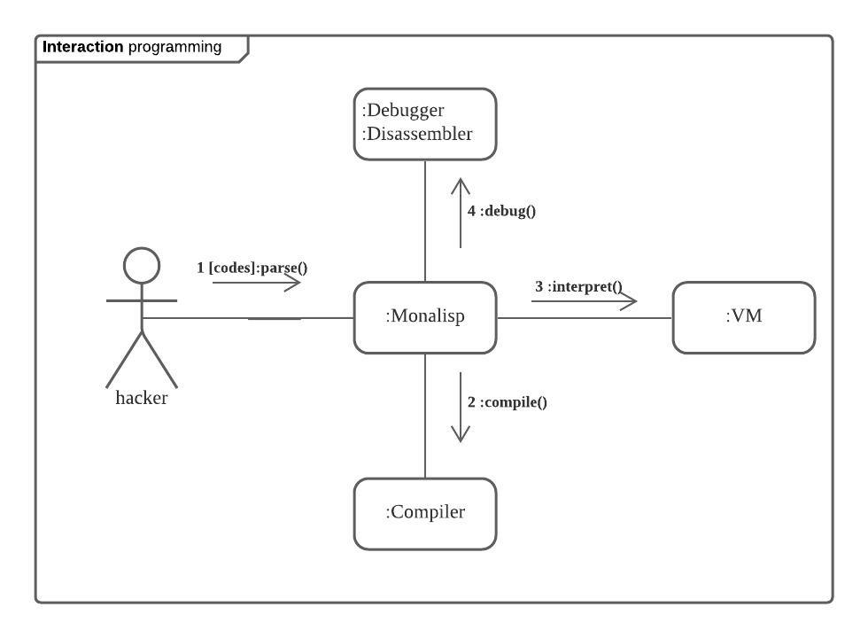

# Overview

## Class Diagram

## Composite Structure Diagram

## Composite X Diagram

TODO: More composite diagrams

## Package Diagram

### Model Diagram

**Layered Monalisp Application**

## Deployments Diagram

# Behavior

## Use Case Diagram

## Monalisp Interaction Overview
TODO

## Baby Activity Diagram

## Sequence Diagram

### API CALL Sequence Diagram

## Timing Diagram

### Online Coding Timing Diagram

## State Machine Diagram

### Debugger State Machine Diagram

## Communication Diagram

### Programming Communication Diagram

UML: Information flows Diagram

UML: Interaction Overview Diagram

UML: Collaboration Use Diagram

