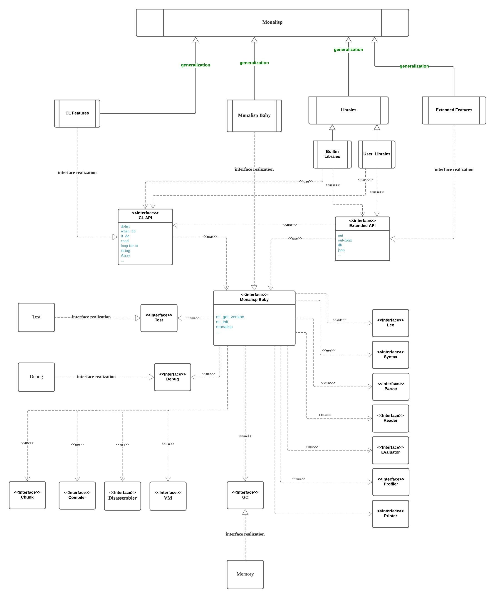
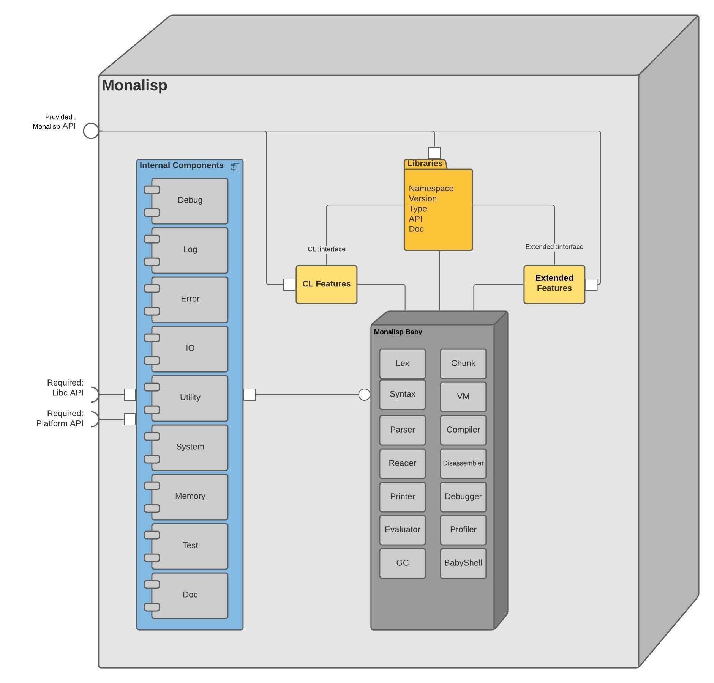
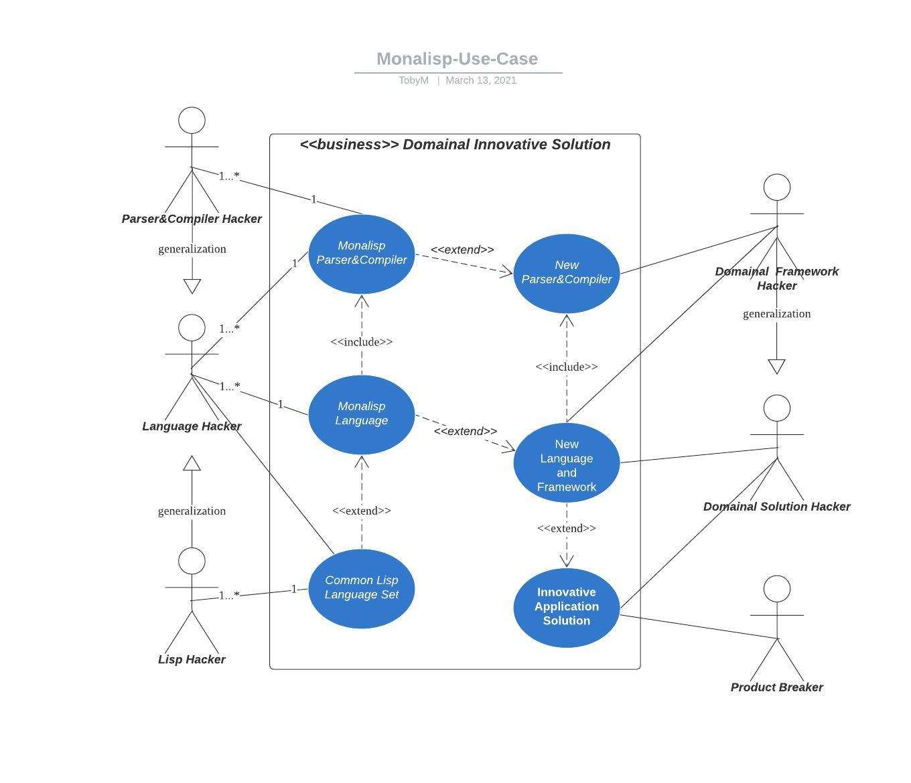
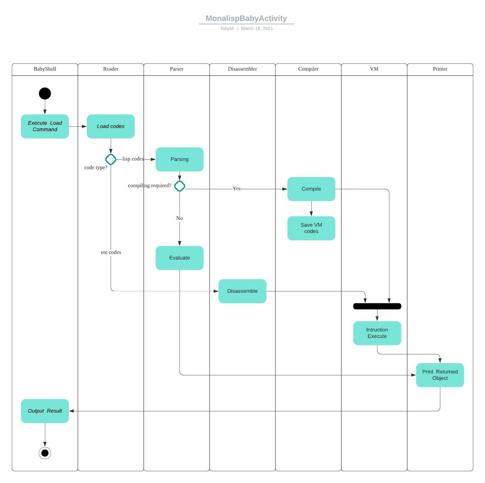

# Overview

## Class Diagram

## Composite Structure Diagram

### Collaboration Use Diagram
TODO

# Behavior

## Use Case Diagram

## Monalisp Interaction Overview
TODO

## Baby Activity Diagram

## Sequence Diagram

### API CALL Sequence Diagram

UML: State Machines

...

