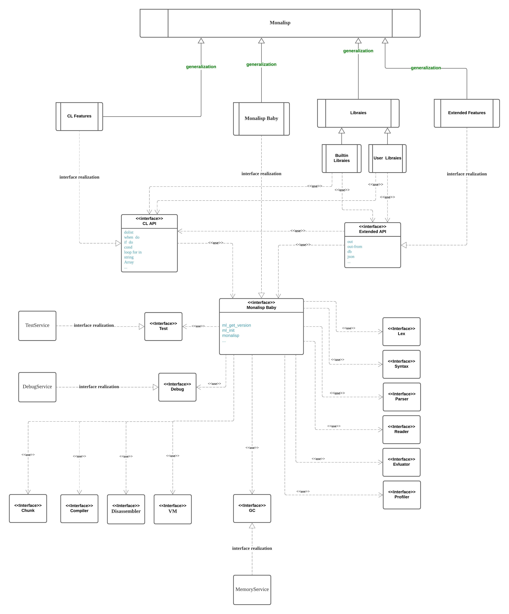

# Monalisp Overview

## Monalisp Class

UML: Composite Structure Diagram

# System Components

UML: Component Diagram

# System Objects

UML: Object Diagram

# Behavior

UML: Interaction Overview

UML: Activities

UML: State Machines

...

