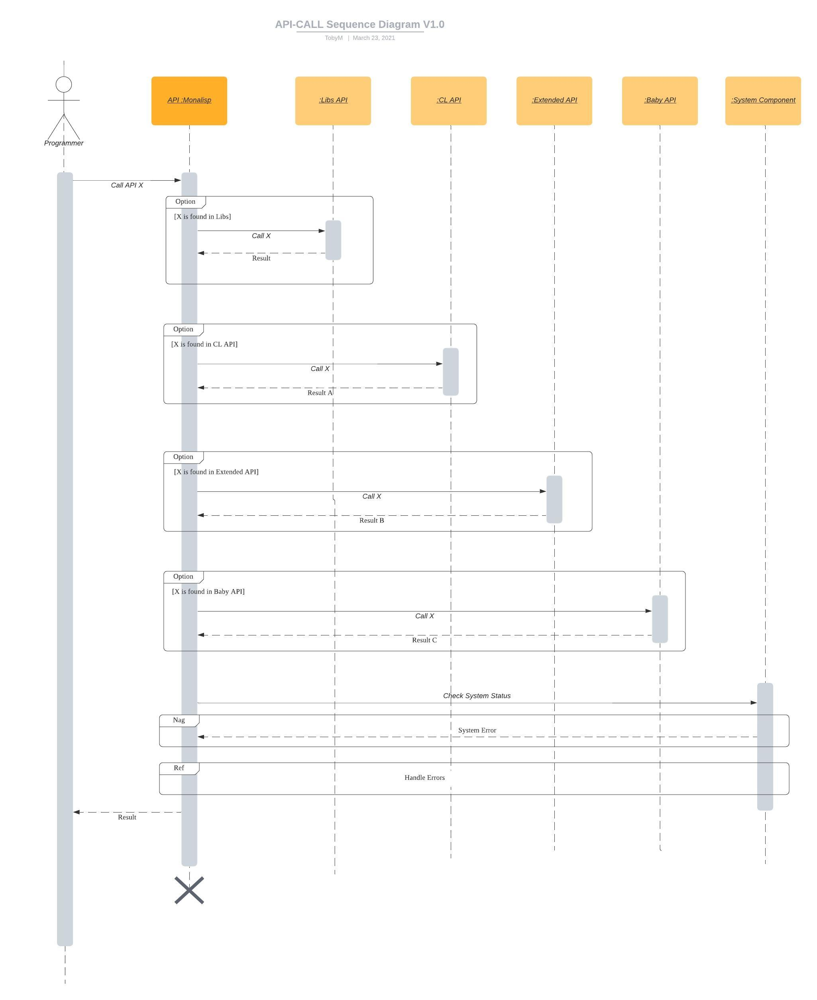

# Overview

## Class Diagram

## Composite Structure Diagram

UML: Composite Diagram

UML: Packages Diagram

UML: Deployments Diagram

# Behavior

## Use Case Diagram

## Monalisp Interaction Overview
TODO

## Baby Activity Diagram

## Sequence Diagram

### API CALL Sequence Diagram

## Timing Diagram

### Online Coding Timing Diagram

## State Machine Diagram

### Debugger State Machine Diagram

UML: Communication Diagram

UML: Information flows Diagram

UML: Interaction Overview Diagram

UML: Collaboration Use Diagram

